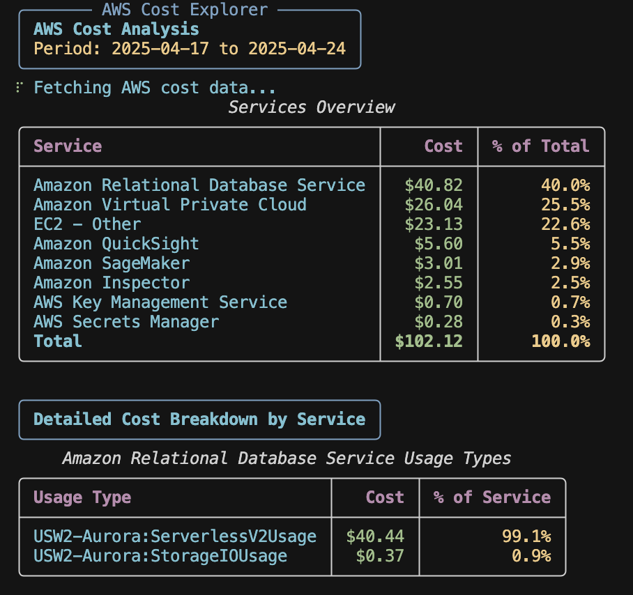

# AWS Cost Explorer CLI

A command-line tool for analyzing AWS costs using the AWS Cost Explorer API. This tool provides detailed cost breakdowns by service and usage type, with beautiful console output or JSON format options.

## Example Output



## Features

- 📊 Beautiful rich console output with formatted tables
- 💰 Detailed cost breakdown by AWS service and usage type
- 📈 Percentage-based analysis of costs
- 🔄 JSON output option for programmatic use
- ⏱️ Customizable time period for analysis
- 🔍 Filters out negligible costs (less than $0.01)

## Prerequisites

- Python 3.7 or higher
- AWS CLI installed and configured
- Required Python packages (listed in requirements.txt)

## AWS Configuration

### 1. Install AWS CLI

First, install the AWS CLI if you haven't already:
```bash
# For macOS
brew install awscli

# For Windows (using PowerShell)
msiexec.exe /i https://awscli.amazonaws.com/AWSCLIV2.msi

# For Linux
curl "https://awscli.amazonaws.com/awscli-exe-linux-x86_64.zip" -o "awscliv2.zip"
unzip awscliv2.zip
sudo ./aws/install
```

### 2. Configure AWS Credentials

Run the following command to configure your AWS credentials:
```bash
aws configure
```

You'll need to provide:
- AWS Access Key ID
- AWS Secret Access Key
- Default region name (e.g., us-east-1)
- Default output format (json)

### 3. Required IAM Permissions

The IAM user or role running this tool needs the following permissions:

```json
{
    "Version": "2012-10-17",
    "Statement": [
        {
            "Effect": "Allow",
            "Action": [
                "ce:GetCostAndUsage"
            ],
            "Resource": "*"
        }
    ]
}
```

To add these permissions:
1. Go to the AWS IAM Console
2. Select your user/role
3. Add the above policy or attach the `AWSCostExplorerReadOnlyAccess` managed policy
4. If using an IAM role, ensure it has the necessary trust relationships configured

## Installation

1. Clone this repository:
   ```bash
   git clone <repository-url>
   cd aws-cost-explorer-cli
   ```

2. Create and activate a virtual environment (recommended):
   ```bash
   python -m venv .venv
   source .venv/bin/activate  # On Windows: .venv\Scripts\activate
   ```

3. Install the required packages:
   ```bash
   pip install -r requirements.txt
   ```

## Usage

### Basic Usage

Run the tool with default settings (last 30 days):
```bash
python app.py
```

### Command-line Options

- `--json`: Output data in JSON format
- `--days <number>`: Specify the number of days to analyze (default: 30)

### Examples

1. View costs for the last 30 days with rich console output:
   ```bash
   python app.py
   ```

2. Get JSON output for the last 7 days:
   ```bash
   python app.py --json --days 7
   ```

3. Analyze the last 90 days:
   ```bash
   python app.py --days 90
   ```

## Output Format

### Console Output

The console output includes:
- A summary panel showing the analysis period
- A services overview table with total costs and percentages
- Detailed breakdown tables for each service showing usage types and costs

### JSON Output

When using the `--json` flag, the output is a structured JSON object containing:
- Total cost
- List of services with their costs and percentages
- Daily cost breakdowns
- Usage type details for each service

## Dependencies

- boto3>=1.26.0: AWS SDK for Python
- pandas>=2.0.0: Data manipulation and analysis
- rich>=13.7.0: Beautiful terminal formatting

## Troubleshooting

### Common Issues

1. **AWS Credentials Not Found**
   - Ensure AWS CLI is properly configured
   - Check if credentials are in `~/.aws/credentials`
   - Verify environment variables `AWS_ACCESS_KEY_ID` and `AWS_SECRET_ACCESS_KEY` if using them

2. **Permission Denied**
   - Verify IAM permissions are correctly configured
   - Check if the IAM user/role has the required Cost Explorer permissions
   - Ensure you're using the correct AWS profile if multiple profiles are configured

3. **No Cost Data Available**
   - Verify you have active AWS resources
   - Check if you're looking at the correct AWS account
   - Ensure Cost Explorer is enabled for your account

